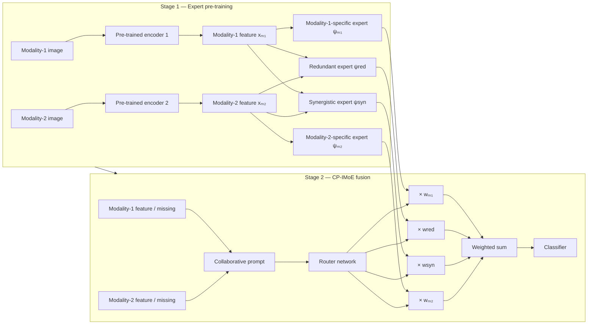

# CP-IMoE

> **[Collaborative Prompt-Guided Interactive Mixture-of-Experts for Incomplete Multimodal Learning](https://openaccess.thecvf.com/content/CVPR2026F/papers/Li_CP-IMoE_Collaborative_Prompt-Guided_Interactive_Mixture-of-Experts_for_Incomplete_Multimodal_Learning_CVPRF_2026_paper.pdf) [Click this link to find the paper]**

CP-IMoE is a PyTorch implementation for learning from *incomplete* paired multimodal data. It first learns experts that describe modality-specific, redundant, and synergistic information, then freezes those experts and uses collaborative prompts plus a router to adaptively combine them when one modality is unavailable.

## Overview

Incomplete multimodal data can contain either both modalities or only one. A fixed fusion rule may over-rely on a missing or uninformative source. CP-IMoE separates the representation into four complementary expert views:

- **Modality-1-specific expert**: preserves information unique to modality 1.
- **Modality-2-specific expert**: preserves information unique to modality 2.
- **Redundant expert**: captures information shared by both modalities.
- **Synergistic expert**: captures cross-modal information that is most useful when the modalities are considered jointly.

A modality-aware collaborative prompt provides a dynamic feature prompt and a modality-status prompt to a router network. The router predicts four normalized interaction weights, and the weighted expert outputs are added before the final classifier.

## Method

### Training and inference pipeline



### Stage 1: expert pre-training

1. **Unimodal pre-training.** A ResNet-50 encoder and a specificity estimator are trained for a single modality. This is run once for each modality to obtain the two modality-specific experts.
2. **Redundant-expert pre-training.** The paired modality features are passed to an interaction estimator. A pull-together objective encourages its output to retain shared information.
3. **Synergistic-expert pre-training.** The same interaction-estimator form is trained with a push-apart objective, encouraging a representation that differs from either standalone modality while remaining discriminative.

### Stage 2: collaborative prompt-guided mixture of experts

The final model loads and **freezes** both ResNet-50 encoders and all four pre-trained experts. For each sample, it simulates or receives a modality-availability pattern and builds:

- a **status prompt** representing complete input, missing modality 1, or missing modality 2; and
- a **dynamic feature prompt** formed from both available features or predicted from the available modality when its partner is missing.

The concatenated prompts are input to a softmax router. Its four weights scale the outputs of the two specific, redundant, and synergistic experts. Their weighted sum is refined by an MLP and classified.

## Repository layout

```text
.
├── Model/
│   ├── CP_IMoE.py                 # Final CP-IMoE model and missing-modality simulation
│   ├── Unimodal_pretrain.py       # Modality-specific expert pre-training model
│   ├── Redundant_pretrain.py      # Shared/redundant expert pre-training model
│   └── Synergistic_pretrain.py    # Synergistic expert pre-training model
├── Dataloader.py                  # Paired image dataset and augmentations
├── Main_pretrain_unimodal.py      # Modality-specific pre-training entry point
├── Main_pretrain_redundant.py     # Redundant-expert pre-training entry point
├── Main_pretrain_synergistic.py   # Synergistic-expert pre-training entry point
├── Main.py                        # Final CP-IMoE training entry point
└── utils_SPC.py                   # Logging, scheduling, seed, and label utilities
```

## Installation

### 1. Create an environment

```bash
conda create -n cp-imoe python=3.10 -y
conda activate cp-imoe
```

### 2. Install dependencies

Install a PyTorch/torchvision build that matches your CUDA driver, then install the Python packages imported by this repository:

```bash
pip install torch torchvision
pip install numpy pandas scikit-learn scipy matplotlib seaborn opencv-python
pip install albumentations tensorflow torchcontrib
```

> `torchcontrib` provides the SWA optimizer wrapper used by the training scripts. If an installation is not available for your PyTorch version, replace it with an equivalent optimizer/SWA implementation before training.

## Data preparation

The bundled loader expects paired image paths and split CSV files. The missing `dependency_SPC.py` configuration module is expected to define, at minimum:

- `source_dir`: directory that prefixes image paths;
- `img_info_path`: metadata CSV containing `clinic`, `derm`, and `diagnosis` columns (plus the seven-point labels used by `utils_SPC.py`);
- `train_index_path`, `val_index_path`, and `test_index_path`: split CSV files with an `indexes` column;
- label vocabularies and counts used by `encode_label`, such as `label_list` and `num_label`.

`Dataloader.py` reads `clinic` as modality 1 and `derm` as modality 2, resizes both images to the configured size (224 × 224 by default), and applies paired augmentations during training. Adapt these field names and paths to use a different paired dataset.

## Pre-trained weights and local paths

The model files currently contain machine-specific absolute checkpoint paths. Before running the scripts, replace those paths with the locations of your own checkpoints (or revise the code to accept them as command-line arguments). The final model expects the following pre-training outputs:

| Component | Expected checkpoint role |
| --- | --- |
| Modality-1 encoder and specificity estimator | modality-1-specific expert |
| Modality-2 encoder and specificity estimator | modality-2-specific expert |
| Interaction estimator trained with pull-together loss | redundant expert |
| Interaction estimator trained with push-apart loss | synergistic expert |

> **Snapshot note.** The entry scripts import modules named `dataloader_SPC`, `dependency_SPC`, and `model.*`, whereas this repository currently provides `Dataloader.py` and `Model/`. Align the module/file names (including case on Linux) and add the dataset configuration module before launching training. This README documents the code that is present and does not claim that omitted data, configuration, or checkpoints are included.

## Training

The scripts use a batch size of 32, 224 × 224 images, Adam with an initial learning rate of `5e-5`, cosine learning-rate scheduling, and 250 epochs by default. Adjust these values in the relevant entry point to suit your hardware and dataset.

Run the stages in order after setting up the import paths, dataset configuration, and checkpoint destinations:

```bash
# 1. Train a modality-specific expert (repeat after selecting modality 2 in the script)
python Main_pretrain_unimodal.py

# 2. Train the redundant/shared expert
python Main_pretrain_redundant.py

# 3. Train the synergistic expert
python Main_pretrain_synergistic.py

# 4. Load frozen experts and train the CP-IMoE router, prompts, and classifier
python Main.py
```

`Main.py` constructs `Base_Model(n_classes=5, p_missing=0.4, dataset_name="SPC")`. The `p_missing` argument controls the proportion of samples affected by the built-in fixed missing-modality simulation. In the current configuration, the final model uses `mode='oct'`, so the first `p_missing` fraction of each batch has modality 2 feature vectors zeroed. Change the mode or provide an external missingness policy to evaluate other settings.

## Reproducibility notes

- Call `set_seed` from `utils_SPC.py` to seed Python, NumPy, and PyTorch; the entry points use seed 42 for `data_mode='Normal'`.
- The scripts set `CUDA_VISIBLE_DEVICES` internally. Update or remove those assignments for your environment.
- Checkpoints and logs are written under `./{mode}_{model_name}_{data_mode}_weight_file/{round}/` by `CraateLogger`.
- Training requires a CUDA-enabled environment as the scripts call `.cuda()` directly.

## Citation

If you find this repository useful for your research, please consider citing:

```bibtex
@inproceedings{li2026cp,
  title={CP-IMoE: Collaborative Prompt-Guided Interactive Mixture-of-Experts for Incomplete Multimodal Learning},
  author={Li, Jing and Zhang, Dongbo and Zheng, Yalin and Meng, Yanda},
  booktitle={Proceedings of the IEEE/CVF Conference on Computer Vision and Pattern Recognition},
  pages={6090--6099},
  year={2026}
}
```
